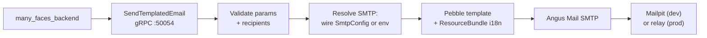

# Many Faces Mailer

<!-- readme-badges:start -->

[](./VERSION)


[](https://github.com/01laky/many_faces_main/actions/workflows/ci.yml)


<!-- readme-badges:end -->

**Version:** [`0.4.2`](./VERSION) · [Changelog](./CHANGELOG.md)

**Author:** Ladislav Kostolny · [01laky@gmail.com](mailto:01laky@gmail.com)

> **Transactional email worker for Many Faces AI.** Renders localized HTML + plain text email templates via Pebble and delivers them through SMTP. The backend holds all product policy and recipient decisions — this worker renders and delivers only. SMTP config comes from admin Settings → Infrastructure (stored in PostgreSQL, forwarded per-request). No public HTTP — only `many_faces_backend` calls this service.

**Canonical repository:** [github.com/01laky/many_faces_mailer](https://github.com/01laky/many_faces_mailer)

---

## Quick Start

```bash
# Full stack (recommended)
cd many_faces_main
./scripts/start-all-dev.sh

# Standalone (worker + Mailpit)
cd many_faces_mailer
./scripts/start-mailer-worker.sh
```

**Ports (development):**

| Endpoint           | Host                     | Container |
| ------------------ | ------------------------ | --------- |
| mailer-worker gRPC | `localhost:59204`        | `50054`   |
| Mailpit SMTP       | `localhost:51025`        | `1025`    |
| Mailpit web UI     | `http://localhost:58025` | `8025`    |

---

## Architecture



1. **`many_faces_backend`** decides policy (who receives, which template) and calls `SendTemplatedEmail` over gRPC.
2. This worker **renders** HTML + plain text from `src/main/resources/templates/` using Pebble, and subject lines from `src/main/resources/i18n/`.
3. **SMTP** delivers to Mailpit in dev or an operator-configured transactional relay in production.

**Toolchain:** Java 21 · Gradle 8 with Foojay resolver · gRPC-Netty · Angus Mail · Pebble. **No Spring** — plain `main`, minimal dependencies.

---

## Three Pillars

| Pillar            | Highlights                                                                                                                                                                                       |
| ----------------- | ------------------------------------------------------------------------------------------------------------------------------------------------------------------------------------------------ |
| **Security**      | gRPC **shared-secret** metadata (`x-mailer-worker-token`); optional **TLS** on listener; no public HTTP; backend is sole caller; templates validated before send; SMTP credentials never logged. |
| **AI**            | Not applicable — deterministic localized template rendering only.                                                                                                                                |
| **Configuration** | **Per-request `SmtpTransportConfig`** from admin (host, port, TLS mode, credentials) **or** env fallback `MAILER_SMTP_*`; **`TestSmtpConnection`** RPC (TCP/STARTTLS probe, no message sent).    |

---

## RPCs

| RPC                             | Purpose                                                                          |
| ------------------------------- | -------------------------------------------------------------------------------- |
| `SendTemplatedEmail`            | Render + deliver one transactional email (HTML + plain text)                     |
| `TestSmtpConnection`            | TCP/STARTTLS smoke probe — validates SMTP reachability without sending a message |
| `grpc.health.v1 / Health.Check` | gRPC health probe                                                                |

---

## Template Catalog (v1)

| `template_id`               | Required `params`                                                 | Locales    |
| --------------------------- | ----------------------------------------------------------------- | ---------- |
| `account_registration_code` | `action_link`, `registration_code`, `user_name`, `expiry_minutes` | `en`, `sk` |
| `identity_email_confirm`    | `action_link`, `user_name`                                        | `en`, `sk` |
| `identity_password_reset`   | `action_link`, `user_name`                                        | `en`, `sk` |

**Signup note:** `action_link` for registration must include `?hash=` (opaque invite id). Full flow: [`../docs/guides/email-code-registration.md`](../docs/guides/email-code-registration.md).

**Tests:** `AccountRegistrationCodeTemplateEdgeTest` — required params, full render, HTML escape.

---

## Correlation (gRPC Metadata)

`many_faces_backend` forwards these metadata keys so worker logs can join API traces:

| Metadata key   | Source                     |
| -------------- | -------------------------- |
| `x-request-id` | HTTP `X-Request-Id`        |
| `traceparent`  | W3C trace context          |
| `tracestate`   | W3C trace state (optional) |

`MailerCorrelationInterceptor` copies them into **SLF4J MDC**: `correlation_id` (`x-request-id` → `traceparent` trace id → UUID), plus `traceparent` / `tracestate` when present. The RPC response `correlation_id` field matches MDC for correlation.

---

## TLS / mTLS Smoke

```bash
chmod +x many_faces_mailer/scripts/smoke-grpc-tls.sh
many_faces_mailer/scripts/smoke-grpc-tls.sh
```

Uses `docker-compose.tls-smoke.yml` (host gRPC: `59216` — does not collide with push smoke `59215`). Generates a throwaway CA + certs, runs `grpcurl Health/Check`, then optional `dotnet test` (`MAILER_TLS_SMOKE=1`).

Full guide: [`../docs/guides/mailer-grpc-tls-mtls.md`](../docs/guides/mailer-grpc-tls-mtls.md)

---

## Ports

| Component                        | Internal gRPC | Host map                                     |
| -------------------------------- | ------------- | -------------------------------------------- |
| many_faces_ai                    | `50051`       | —                                            |
| many_faces_elastic search-worker | `50052`       | `59202`                                      |
| many_faces_push push-worker      | `50053`       | `59203`                                      |
| **mailer-worker**                | **`50054`**   | **`59204`** (`MAILER_WORKER_GRPC_HOST_PORT`) |
| **mailpit** SMTP                 | **`1025`**    | **`51025`** (`MAILPIT_SMTP_HOST_PORT`)       |
| **mailpit** UI                   | **`8025`**    | **`58025`** (`MAILPIT_UI_HOST_PORT`)         |

---

## Scripts

| Script                             | Purpose                |
| ---------------------------------- | ---------------------- |
| `./scripts/start-mailer-worker.sh` | Start worker + Mailpit |
| `./scripts/stop-mailer-worker.sh`  | Stop containers        |
| `./scripts/smoke-grpc-tls.sh`      | TLS/mTLS smoke test    |

---

## Proto Contracts

Canonical `.proto` lives in the nested **`many_faces_proto`** submodule at `many_faces_mailer/many_faces_proto/`:

```
manyfaces/mailer/v1/mailer.proto
```

Gradle resolves `many_faces_proto/proto` at build time. `many_faces_backend` generates its own C# client stubs from its own nested `many_faces_proto` via `BeDemo.Api.csproj`.

```bash
git submodule update --init --recursive   # populate nested submodule
```

---

## Security Notes

| Risk                   | Mitigation                                                                    |
| ---------------------- | ----------------------------------------------------------------------------- |
| **Spoofed gRPC sends** | Require `MAILER_WORKER_EXPECTED_TOKEN` + TLS before non-local exposure        |
| **Credential theft**   | SMTP credentials are high value; restrict env injection; rotate on compromise |
| **Template injection** | Pebble auto-escapes HTML; params validated before render                      |

---

## Monorepo Integration

- Submodule path: `many_faces_mailer/` under `many_faces_main`
- Initialize: `git submodule update --init --recursive many_faces_mailer`
- Backend wires via `Mail__WorkerGrpcUrl` (or `Mail__WorkerAuthToken` for secret)
- Dev Mailpit (`localhost:58025`) catches all outbound email — no external sends in dev

---

## Documentation

| Topic                       | Link                                                                                           |
| --------------------------- | ---------------------------------------------------------------------------------------------- |
| **Local dev wiring**        | [`../docs/guides/mailer-local-dev.md`](../docs/guides/mailer-local-dev.md)                     |
| **Admin SMTP config**       | [`../docs/guides/admin-mailer-configuration.md`](../docs/guides/admin-mailer-configuration.md) |
| **TLS / mTLS**              | [`../docs/guides/mailer-grpc-tls-mtls.md`](../docs/guides/mailer-grpc-tls-mtls.md)             |
| **Email registration flow** | [`../docs/guides/email-code-registration.md`](../docs/guides/email-code-registration.md)       |
| **Monorepo docs hub**       | [`../docs/README.md`](../docs/README.md)                                                       |

---

## Project Status

Active transactional email worker for the Many Faces AI monorepo. v0.4.2 — `SendTemplatedEmail` (Pebble HTML+text, en/sk), `TestSmtpConnection`, per-request SMTP transport override, correlation interceptor, gRPC TLS/mTLS, Mailpit dev sink. Tracked in [`CHANGELOG.md`](./CHANGELOG.md).
