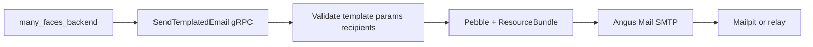

# many_faces_mailer

Standalone **Java gRPC mailer worker** (SMTP, templated email, UTF-8 i18n) for Many Faces.  
Linked as a **git submodule** from `many_faces_main` at `many_faces_mailer/`.

```bash
# From many_faces_main root
git submodule update --init --recursive many_faces_mailer
```

**Toolchain:** **Java 21** (Gradle toolchain + Foojay resolver for reproducible CI). **No Spring** — plain `main`, gRPC-Netty, Angus Mail, Pebble.

## Architecture

1. **`many_faces_backend`** decides policy (who receives which template) and calls **`SendTemplatedEmail`** over gRPC.
2. This worker **renders** HTML + plain text from **`src/main/resources/templates/`** and subject lines from **`src/main/resources/i18n/`**.
3. **SMTP** delivers to Mailpit (dev) or a transactional relay (prod).



## Template catalog (v1)

| `template_id`               | Required `params`                                                 | Supported locales (bundles) |
| --------------------------- | ----------------------------------------------------------------- | --------------------------- |
| `account_registration_code` | `action_link`, `registration_code`, `user_name`, `expiry_minutes` | `en`, `sk`                  |
| `identity_email_confirm`    | `action_link`, `user_name`                                        | `en`, `sk`                  |
| `identity_password_reset`   | `action_link`, `user_name`                                        | `en`, `sk`                  |

**Signup:** `action_link` must include query **`?hash=`** (opaque invite id). Monorepo flow: **[`docs/guides/email-code-registration.md`](../docs/guides/email-code-registration.md)**.

**Tests:** `AccountRegistrationCodeTemplateEdgeTest` (required params, render, HTML escape).

## Ports

| Component         | Internal gRPC | Default host map                           |
| ----------------- | ------------- | ------------------------------------------ |
| **mailer-worker** | **50054**     | **59204** (`MAILER_WORKER_GRPC_HOST_PORT`) |
| **mailpit** SMTP  | **1025**      | **51025** (`MAILPIT_SMTP_HOST_PORT`)       |
| **mailpit** UI    | **8025**      | **58025** (`MAILPIT_UI_HOST_PORT`)         |

## Quick start (Docker)

```bash
./scripts/start-mailer-worker.sh
```

Stop:

```bash
./scripts/stop-mailer-worker.sh
```

## TLS / mTLS smoke (CI + local)

- **`docker-compose.tls-smoke.yml`** — isolated worker with server TLS + mTLS (PEMs under **`MAILER_TLS_SMOKE_CERT_DIR`**). Default published gRPC: **`127.0.0.1:59216`** (does not collide with push TLS smoke **59215**).
- **`scripts/smoke-grpc-tls.sh`** — generates a throwaway CA + certs, runs **`grpcurl`** `Health/Check`, then optional **`dotnet test`** filtered to **`MailerWorkerTlsEndToEndSmokeTests`** (`MAILER_TLS_SMOKE=1`). Docker Compose project: **`mf-mailer-tls-smoke`** (same name as `clear-all-dev.sh`).

Monorepo guide: **`docs/guides/mailer-grpc-tls-mtls.md`**.

## C# client stubs (many_faces_backend)

The canonical **`.proto`** lives in the **`many_faces_proto`** submodule **nested under this repository** (`manyfaces/mailer/v1/mailer.proto`). Gradle resolves **`many_faces_proto/proto`**. **`many_faces_backend`** generates the C# client from its own nested **`many_faces_proto`** via `BeDemo.Api.csproj`.

## Environment

See **`.env.example`**. For monorepo wiring (Mailpit, `Mail:*`, grpcurl), read **`docs/guides/mailer-local-dev.md`** in the parent repository.

## Correlation (gRPC metadata)

`many_faces_backend` forwards these **metadata keys** (lowercase ASCII) on `SendTemplatedEmail` so worker logs can join API traces:

| Metadata key   | Source (typical)           |
| -------------- | -------------------------- |
| `x-request-id` | HTTP `X-Request-Id`        |
| `traceparent`  | W3C trace context          |
| `tracestate`   | W3C trace state (optional) |

`MailerCorrelationInterceptor` copies them into **SLF4J `MDC`**: `correlation_id` (from `x-request-id`, else trace id from `traceparent`, else UUID), plus `traceparent` / `tracestate` when present. The RPC response `correlation_id` field matches `MDC` for successful sends.

## Security

- **Spoofed gRPC sends** — any process that can reach the listener can invoke the worker; require **`MAILER_WORKER_EXPECTED_TOKEN`** (and TLS/mTLS for shared networks) before non-local exposure.
- **Credential theft** — SMTP credentials are high value; restrict mounts and env injection; rotate on compromise.

## License

See the root monorepo or team policy (demo stack).
